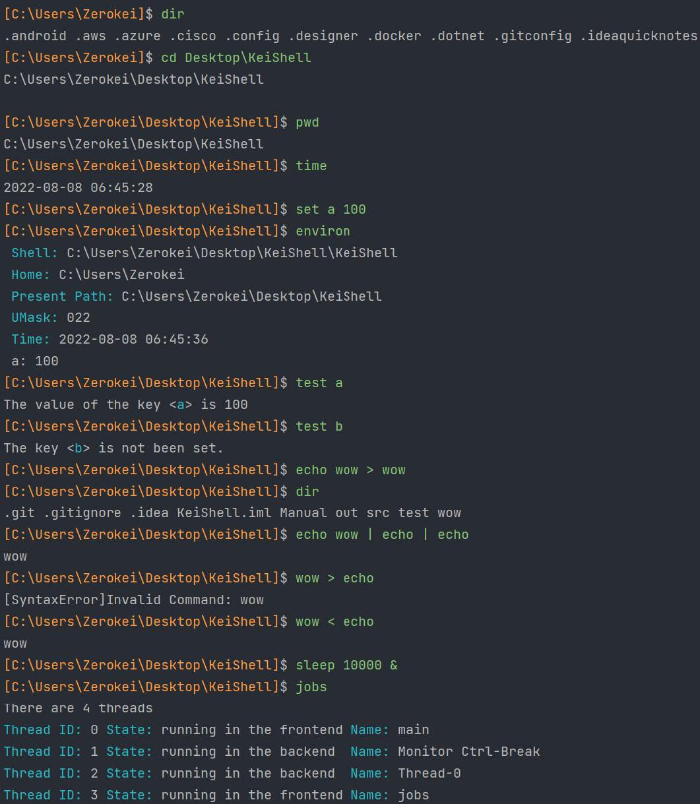

# KeiShell :dog:

KeiShell is a simple shell emulator implemented in Java, which supporting serval simple commands and symbols.

## About
- `language`: Java
- `java-version:` 18
- `IDE`: IntelliJ IDEA 2022.2
- `OS`: Windows11

## Features
### Available Command
You can see details in Manual
- `dir [ FILE ]`
- `echo [ STRING ]`
- `exec COMMNAD [ ARGS ]`
- `cd [ DIR ]`
- `pwd`
- `test [ VAR ]`
- `set [ VAR ] [ VAL ]`
- `time`
- `jobs`
- `umask`
- `environ`
- `exit`
- `help`
- `clr`
- `sleep [ TIME ]`

### Available Symbols
- `|`
- `<`
- `>`
- `>>`
- `&`


## Usage

```bash
$ java -jar .\KeiShell.jar # run KeiShell
$ java -jar .\KeiShell.jar test\myshell_case # run KeiShell with file as input
```


## Demos


## References
[Shellino](https://github.com/PAN-Ziyue/Shellino) -- My program references a lot of its design.
